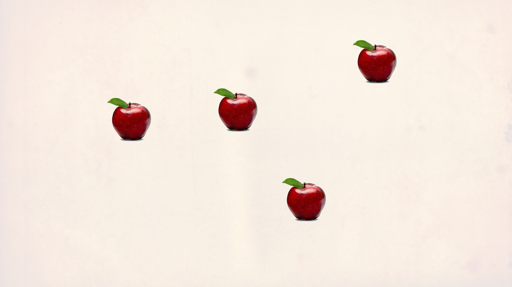
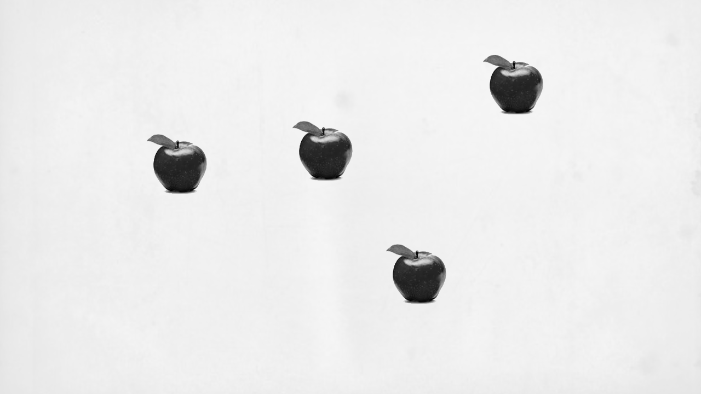
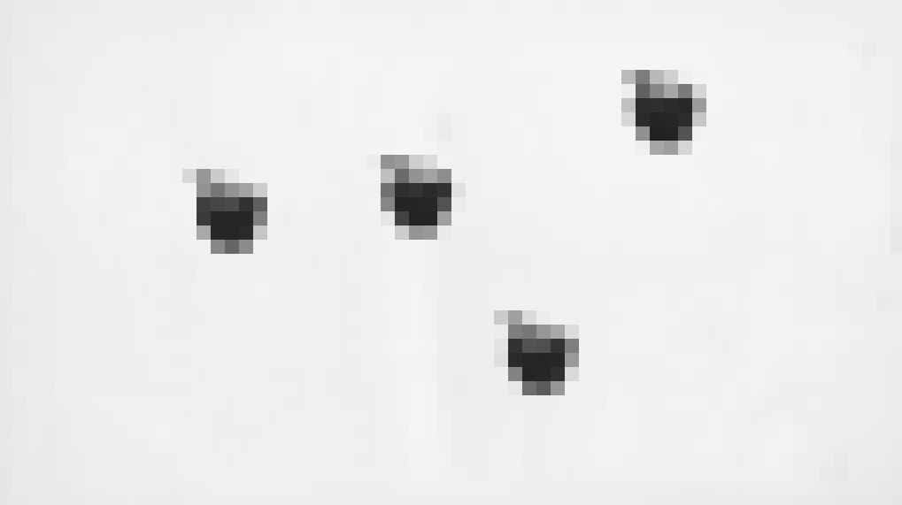
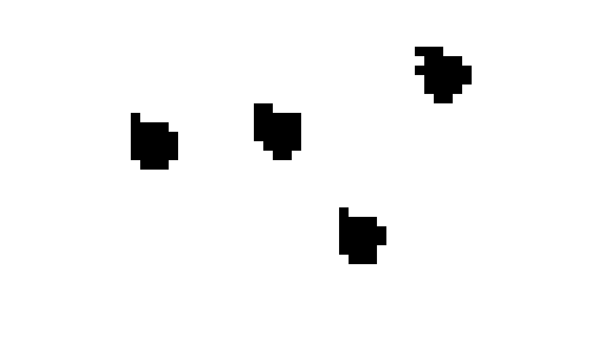
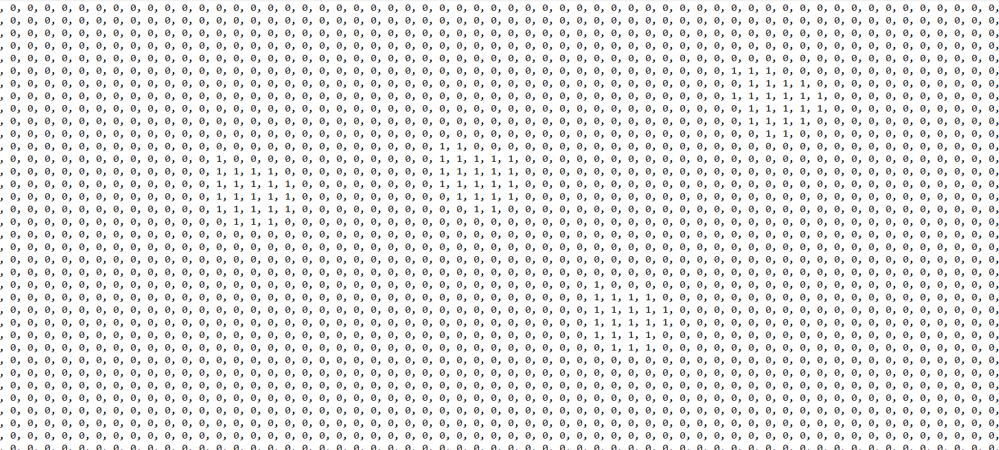
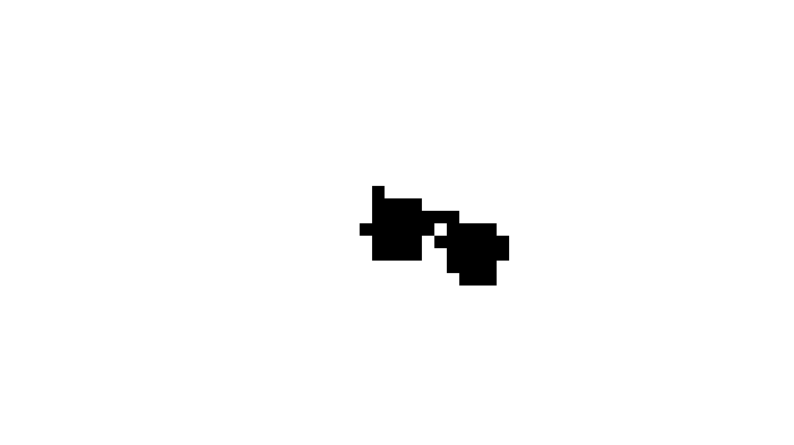
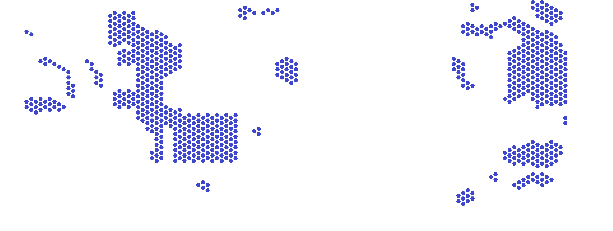

# Object-Counting-Algorithm

It is an image processing algorithm developed to count objects. It doesn't contain neural networks, it's simple and fast. Basicly, it detects groups of connected colors different from the background.
 

## How does it work?

Let's take the apples below as an example to see how the process works.

First, we convert the image to grayscale to remove extra colors we won't be using.

Then, we need to scale the image before processing. If we implement the same transactions at original scale it takes a very long time and the program exceeds the function recursion limit.

After that, we convert the image to black and white according to color scale that we defined.

Finally, we transform the black and white pixels into a two-dimensional list of ones and zeros.

At this point, the algorithm starts looping through the list, and when it finds a "1", it checks the neighbors of the "1" with function recursion and adds them to a checklist. And when it finds all the 1's that connected together, it takes it as a group and assumes it as a single object. The algorithm continues until it finds all the "1" groups.

----

Objects that are close to each other in the image, and the pixel connection between them, which occurs due to the rescaling process, is a big problem. They would be counted as a single object because of our algorithm structure. Different methods can be used here, but I preferred detecting objects' thin parts and making a distinction according to the ratio difference that will occur when  it is divided from there.

## Usage Example

The image you see above is a game map with the background removed. While it is very difficult to count the regions here one by one, the number of them can be found quickly and basicly using this algorithm. 

## Contribution
It can be developed for various tasks. You can modify and use it for your projects. It's still in development. Any contribution is welcome.